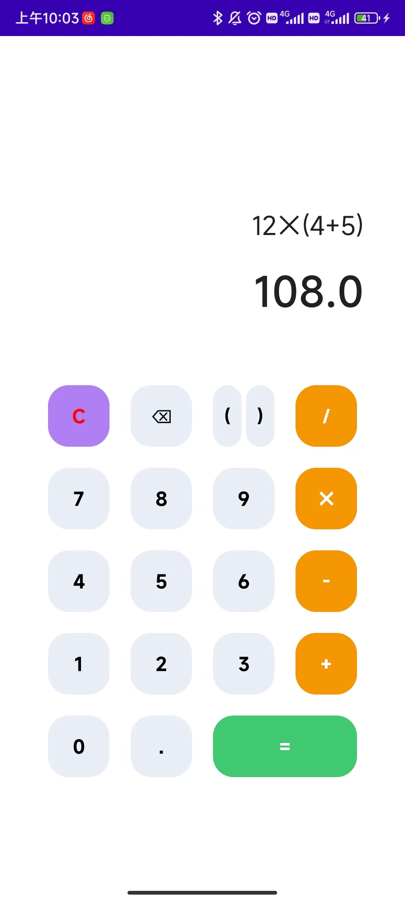
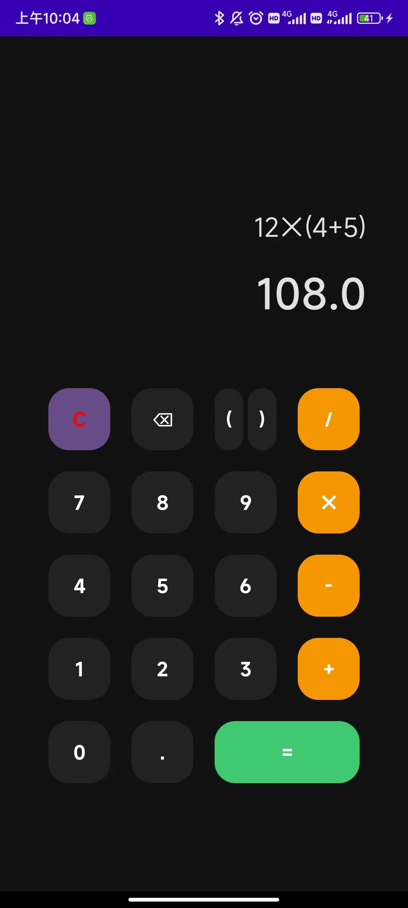
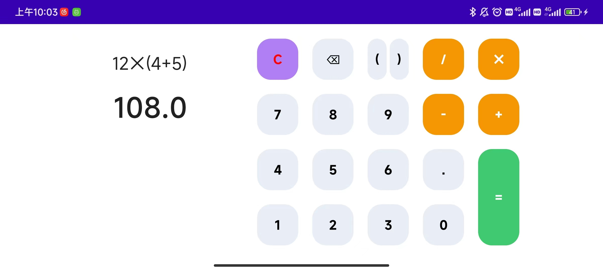
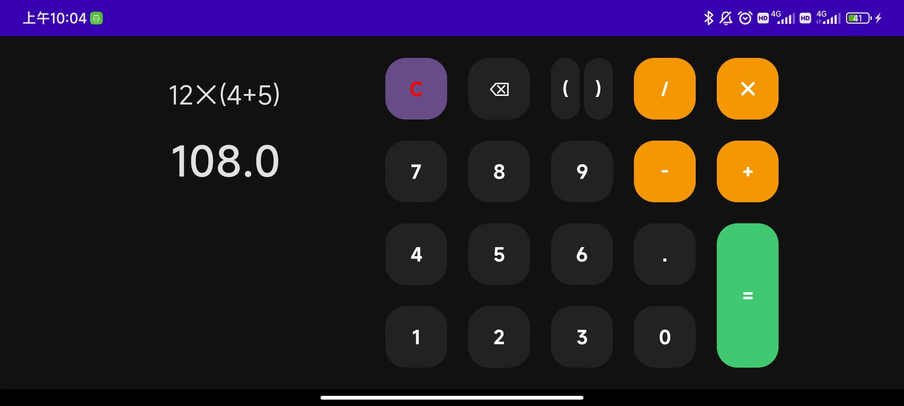

# ComposeCalculator

这个项目是参加 [Android Jetpack Compose Study Jam](https://www.gdgcn.net/?page_id=477) 进阶挑战赛的作品。

使用 Jetpack Compose 实现一个简单的计算器。实现的功能如下：

- 支持四则运算
- 适配横竖屏
- 适配深色模式

## App 截图

| 竖屏浅色 | 竖屏深色 | 横屏浅色 | 横屏深色 |
| :----: | :----: | :----: | :----: |
|  |  |  |   |

## App 下载

在项目 `release` 目录下提供了 release apk 文件，可以直接安装体验。

## 项目实现

- 计算器 UI 设计，来自 [设计之家](https://www.sj33.cn/digital/uisj/201905/50609.html)
- 计算器核心的计算功能，来自 [exp4j](https://www.objecthunter.net/exp4j/)
